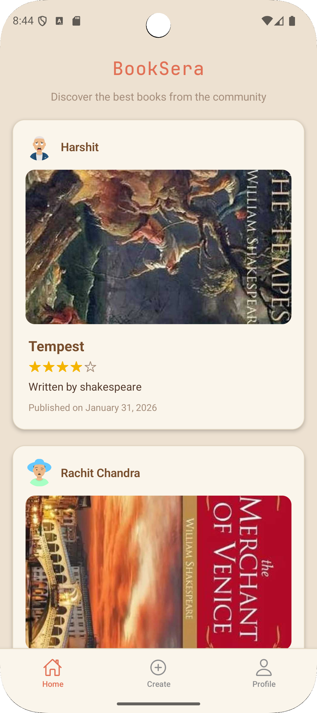
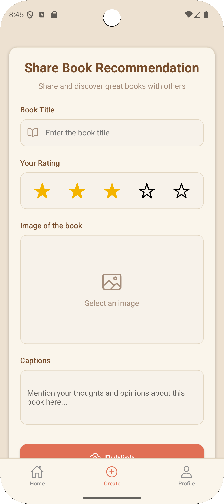
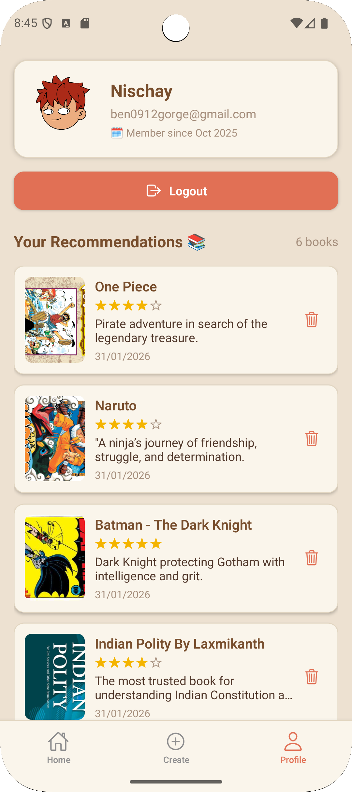

# 📚 BOOKSERA - Community Book Recommendation Mobile App

A modern full-stack mobile application where users can share, browse, and rate book recommendations within a reading community.

Built using React Native + Expo for the frontend and Node.js + Express + MongoDB for the backend, BOOKSERA allows users to post book covers, write reviews, rate books, and interact through a clean social feed.

Works seamlessly on Android, iOS, and Web — with zero native code.

---

## 📸 App Screenshots

<p align="center">
  <b>Home</b>&nbsp;&nbsp;&nbsp;&nbsp;&nbsp;&nbsp;
  <b>Create</b>&nbsp;&nbsp;&nbsp;&nbsp;&nbsp;&nbsp;
  <b>Profile</b><br/><br/>

  
  
  
</p>

---

## ✨ Features

🔐 JWT Authentication (Signup / Login / Logout)  
🏠 Community Feed with newest-first posts  
➕ Create Post with title, rating, caption & cover image  
🖼️ Cloud image uploads using Cloudinary  
👤 Profile screen showing user info & posts  
🗑️ Delete post with confirmation  
🎨 4 instant themes (color switch support)  
♾️ Infinite scrolling with pagination  
💾 Persistent login using AsyncStorage  
🌐 Web support (runs in browser with Expo)  
📱 Cross-platform mobile support   

---

## 🛠️ Tech Stack

| Technology | Purpose |
|-----------|---------|
| React Native | Mobile app development |
| Expo | Build & run app easily |
| JavaScript | Core programming language |
| Expo Router | Navigation |
| Node.js | Backend runtime |
| Express.js | REST API server |
| MongoDB | Database |
| Mongoose | ODM for MongoDB |
| JWT | Authentication |
| bcrypt | Password hashing |
| Cloudinary | Image hosting |
| Zustand | State management |
| AsyncStorage | Persistent login |

---

## 📂 Project Structure

```
BOOKSERA/
    mobile/
        app/
        components/
        screens/
        store/
        hooks/
        assets/
        package.json

    backend/
        src/
            routes/
            controllers/
            models/
            middleware/
            index.js
        package.json
```

---

## ⚙️ Environment Variables

### Backend (/backend/.env)

```
PORT=3000
MONGO_URI=your_mongodb_uri
JWT_SECRET=your_secret_key

CLOUDINARY_CLOUD_NAME=your_cloud_name
CLOUDINARY_API_KEY=your_api_key
CLOUDINARY_API_SECRET=your_api_secret

API_URL=http://localhost:3000
```

---

## 🚀 Getting Started

### 1️⃣ Start Backend

```
cd backend
npm install
npm run dev
```

Server runs on:
```
http://localhost:3000
```

---

### 2️⃣ Start Mobile

```
cd mobile
npm install
npx expo start
```

Press:

- A → Android  
- I → iOS  
- W → Web  

---

## 📡 API Endpoints

### Auth
POST /api/auth/signup  
POST /api/auth/login  

### Posts
GET /api/posts  
POST /api/posts  
DELETE /api/posts/:id  

---

## 🔒 Security Features

✅ JWT authentication  
✅ Password hashing (bcrypt)  
✅ Protected routes middleware  
✅ Secure image uploads  
✅ Environment variables  

---

## 🎯 Responsibilities / Contributions

• Designed complete mobile UI with React Native  
• Built backend REST APIs using Express  
• Designed MongoDB schemas for Users & Posts  
• Integrated Cloudinary for image uploads  
• Implemented JWT authentication  
• Managed global state using Zustand  
• Developed CRUD operations  
• Structured scalable MVC architecture  

---

## 📦 Deployment

### Backend
Render / Railway / Fly.io

### Mobile
```
npx expo build
```

---

## 👨‍💻 Author

**Nischay Kumar**  
Full-Stack & React Native Developer  

---

## ⭐ Support

If you like this project, give it a ⭐ on GitHub!
